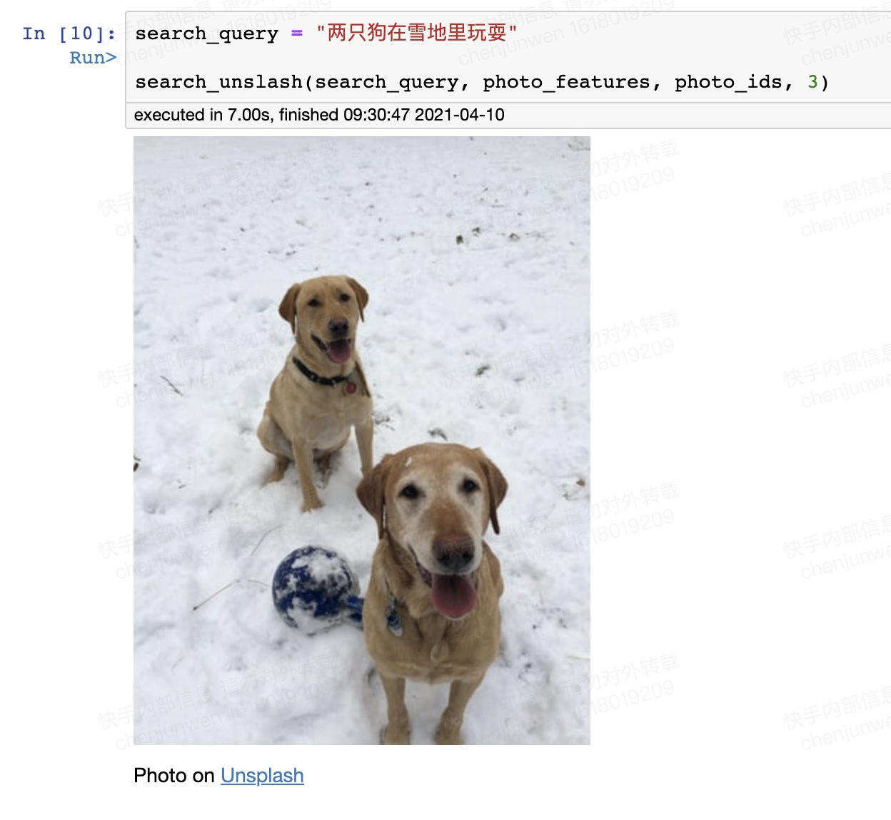
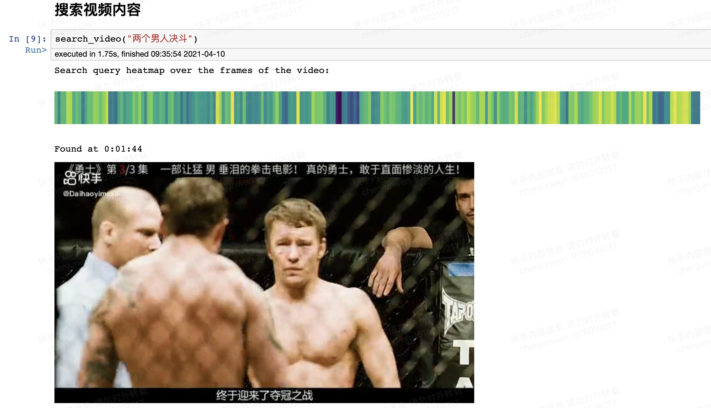

# CLIP中文encoder

CLIP Chinese Text Encoder：本项目适配了Open AI的CLIP `ViT-B/32` 模型的文本encoder部分，搭配官方的图片encoder，使用效果不错，欢迎大家试用讨论。

## 使用

- 将本项目clone至本地。
- 通过链接下载模型参数文件`clip_zh.mse.pt`和开源数据`unsplash-dataset`至目录`data`。
    - 链接：https://pan.baidu.com/s/1YKk3h6N-Sg2JmkuIxMD6Pg 提取码：0v9u 
- 安装依赖：`pip install -r requirements.txt`
- 使用：在本地启动`jupyter notebook`，打开`notebooks`目录下的笔记本体验。
    - `chinese_demo.ipynb`：以文搜图。
    - `video_demo.ipynb`：以文搜视频。

## 介绍

Open AI的CLIP模型使用海量图文对，用文本帮助图片做预训练。官方开源的模型，以文搜图的效果惊艳。但官方只采用了英文，在中文使用时必须采用翻译，增加了中文使用CLIP的不确定性。如果可以适配固定的中文encoder，并通过客观评估找出一些优质的，将会极大便利中文数据使用CLIP做下游任务。

本encoder目前支持中英双语。

训练原理如下图所示，encoder本身采用CLIP原来的文本encoder结构：

训练数据为中英开源平行语料。

## 效果

以文搜图：

以文搜视频：

## 量化评估

在内部有中英文标签的数据集上做了zero-shot transfer的评估，效果不错，暂不展示数据。各位有了解其他评测方案的或者开源带多语言标签的数据集的欢迎推荐。

## 参考资料

- [CLIP官方仓库](https://github.com/openai/CLIP)
- [CLIP英文搜图仓库](https://github.com/haltakov/natural-language-image-search)
- [CLIP英文搜视频仓库](https://github.com/haltakov/natural-language-youtube-search)
